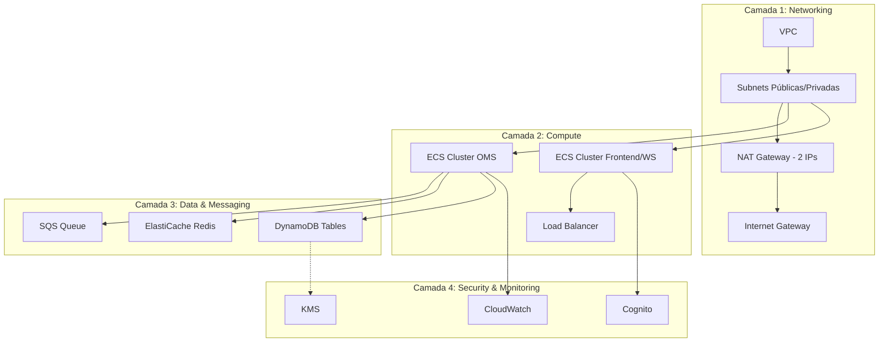

# Documentação - OMS Spider Infrastructure

Documentação completa da infraestrutura AWS do OMS Spider.

## 📖 Visão Geral

Esta documentação cobre todos os aspectos da infraestrutura como código (IaC) do OMS Spider, desde a arquitetura de alto nível até detalhes de implementação de cada componente.

## 🗂️ Estrutura da Documentação

### 📌 [Geral](general/)
Documentação de alto nível sobre arquitetura e deployment.

- **[architecture.md](general/architecture.md)** ⭐ - **LEITURA OBRIGATÓRIA**
  - Arquitetura completa do sistema
  - Diagramas Mermaid e Draw.io
  - Fluxos de dados detalhados
  - Requisitos de whitelist de IPs
  - Custos estimados
  - Multi-AZ e HA

- **[deployment.md](general/deployment.md)** - Guia completo de implantação
  - Ordem de deploy dos recursos
  - Comandos AWS CLI
  - Troubleshooting comum

### 🌐 [Networking](networking/)
Componentes de rede e conectividade.

- **[vpc.md](networking/vpc.md)** - VPC, Subnets, Route Tables
- **[nat-gateway.md](networking/nat-gateway.md)** - NAT Gateway e Elastic IPs (whitelist)
- **[security-groups.md](networking/security-groups.md)** - Security Groups e NACLs
- **[endpoints.md](networking/endpoints.md)** - VPC Endpoints (DynamoDB, S3)

### 💻 [Compute](compute/)
ECS clusters, tasks e services.

- **[ecs-clusters.md](compute/ecs-clusters.md)** - Configuração dos clusters ECS
- **[task-definitions.md](compute/task-definitions.md)** - Task definitions para OMS e Frontend
- **[auto-scaling.md](compute/auto-scaling.md)** - Políticas de auto scaling
- **[load-balancer.md](compute/load-balancer.md)** - Application Load Balancer

### 💾 [Storage](storage/)
Armazenamento e mensageria.

- **[sqs.md](storage/sqs.md)** - SQS Queue para ordens
- **[elasticache.md](storage/elasticache.md)** - Redis cluster configuration
- **[ecr.md](storage/ecr.md)** - Elastic Container Registry

### 🔐 [Cognito](cognito/)
Autenticação e autorização.

- **[overview.md](cognito/overview.md)** - Visão geral do Cognito User Pool
- **[setup-guide.md](cognito/setup-guide.md)** - Guia de configuração e deploy
- **[mfa.md](cognito/mfa.md)** - Configuração de MFA obrigatório
- **[groups.md](cognito/groups.md)** - Admin, Operator, Viewer groups

### 🗄️ [DynamoDB](dynamodb/)
Banco de dados NoSQL.

- **[overview.md](dynamodb/overview.md)** - Estrutura geral das tabelas
- **[config-table.md](dynamodb/config-table.md)** - Tabela de configurações
- **[trading-table.md](dynamodb/trading-table.md)** - Tabela de dados transacionais
- **[gsi.md](dynamodb/gsi.md)** - Global Secondary Indexes
- **[backup.md](dynamodb/backup.md)** - Estratégias de backup e PITR

### 🔄 [CI/CD](cicd/)
Pipeline de integração e deploy contínuo.

- **[overview.md](cicd/overview.md)** - Visão geral da pipeline
- **[setup-guide.md](cicd/setup-guide.md)** - Configuração do CodePipeline
- **[codestar-connection.md](cicd/codestar-connection.md)** - GitHub integration (recomendado)
- **[quickstart-codestar.md](cicd/quickstart-codestar.md)** - Quick start CodeStar
- **[buildspec.md](cicd/buildspec.md)** - Buildspec configuration
- **[ecr-push.md](cicd/ecr-push.md)** - Push automático para ECR

## 🎯 Começando

### Para Novos Desenvolvedores

1. **Leia primeiro**: [general/architecture.md](general/architecture.md)
   - Entenda a arquitetura completa
   - Veja os diagramas de fluxo
   - Compreenda o requisito de whitelist de IPs

2. **Deploy básico**: [general/deployment.md](general/deployment.md)
   - Ordem correta de deploy
   - Comandos prontos para uso

3. **Componentes específicos**: Consulte as seções acima
   - Cada componente tem documentação detalhada
   - Templates CloudFormation explicados

### Para DevOps/SRE

1. **Networking**: Comece por [networking/](networking/)
   - VPC design e subnetting
   - NAT Gateway para whitelist
   - Security Groups

2. **Compute**: Veja [compute/](compute/)
   - ECS cluster configuration
   - Auto scaling policies
   - Load balancing

3. **Monitoring**: CloudWatch e métricas
   - Alertas configurados
   - Dashboards recomendados

## 🏗️ Arquitetura de Referência



## 🔑 Conceitos-Chave

### Whitelist de IPs nas Exchanges

**Requisito Crítico**: Exchanges exigem whitelist de IPs fixos.

**Solução**:
- NAT Gateway com 2 Elastic IPs estáticos
- Todo tráfego de saída passa pelo NAT
- Containers em Private Subnets

**Documentação**: [networking/nat-gateway.md](networking/nat-gateway.md)

### ECS com EC2 (não Fargate)

**Por quê EC2?**
- Controle total sobre instâncias
- Otimização de custos para workloads constantes
- Networking avançado (ENI placement)

**Documentação**: [compute/ecs-clusters.md](compute/ecs-clusters.md)

### Multi-Cluster Strategy

**2 Clusters Separados**:
1. **OMS Cluster**: Processamento de ordens (crítico)
2. **Frontend/WebSocket Cluster**: Interface e recebimento

**Benefícios**:
- Isolamento de recursos
- Scaling independente
- Segurança (diferentes security groups)

**Documentação**: [general/architecture.md](general/architecture.md)

### SQS para Desacoplamento

**Padrão**: Producer-Consumer
- **Producer**: WebSocket recebe ordens
- **Queue**: SQS buffer
- **Consumer**: OMS processa

**Benefícios**:
- Resiliência a falhas
- Backpressure handling
- Replay capability

**Documentação**: [storage/sqs.md](storage/sqs.md)

## 📊 Ambientes

| Componente | dev | staging | prod |
|------------|-----|---------|------|
| VPC CIDR | 10.0.0.0/16 | 10.1.0.0/16 | 10.2.0.0/16 |
| NAT Gateways | 1 (single-AZ) | 2 (multi-AZ) | 2 (multi-AZ) |
| ECS Instance Type | t3.small | t3.medium | t3.large+ |
| Redis Instance | t3.micro | t3.small | r6g.large |
| DynamoDB PITR | ❌ | ❌ | ✅ |
| CloudWatch Retention | 7 dias | 14 dias | 30 dias |

## 🛠️ Templates CloudFormation

Todos os templates estão em [`../templates/`](../templates/):

```
templates/
├── networking/
│   ├── vpc.json                    # VPC, Subnets, Route Tables
│   ├── nat-gateway.json            # NAT Gateway com Elastic IPs
│   └── security-groups.json        # Security Groups
├── compute/
│   ├── ecs-cluster-oms.json       # Cluster OMS
│   ├── ecs-cluster-frontend.json  # Cluster Frontend/WS
│   ├── task-def-oms.json          # Task Definition OMS
│   └── alb.json                   # Application Load Balancer
├── storage/
│   ├── sqs-queue.json             # SQS Orders Queue
│   └── elasticache-redis.json     # Redis Cluster
├── cognito/
│   └── cognito-user-pool.json     # User Pool + Groups
├── dynamodb/
│   ├── oms-config-table.json      # Config Table
│   └── oms-trading-table.json     # Trading Table
└── cicd/
    └── codepipeline-codestar.json # CI/CD Pipeline
```

## 🔍 Como Usar Esta Documentação

### Busca por Componente

**Quero entender/configurar...**
- VPC e Networking → [`networking/`](networking/)
- ECS Clusters → [`compute/`](compute/)
- SQS ou Redis → [`storage/`](storage/)
- Autenticação → [`cognito/`](cognito/)
- DynamoDB → [`dynamodb/`](dynamodb/)
- CI/CD → [`cicd/`](cicd/)

### Busca por Tarefa

**Quero fazer...**
- Deploy inicial → [`general/deployment.md`](general/deployment.md)
- Configurar whitelist IPs → [`networking/nat-gateway.md`](networking/nat-gateway.md)
- Configurar autenticação → [`cognito/setup-guide.md`](cognito/setup-guide.md)
- Setup CI/CD → [`cicd/setup-guide.md`](cicd/setup-guide.md)
- Entender custos → [`general/architecture.md#custos`](general/architecture.md)

### Busca por Problema

**Tenho um problema com...**
- IPs não whitelistados → [`networking/nat-gateway.md`](networking/nat-gateway.md)
- Containers não iniciam → [`compute/ecs-clusters.md`](compute/ecs-clusters.md)
- Filas SQS crescendo → [`storage/sqs.md`](storage/sqs.md)
- Redis out of memory → [`storage/elasticache.md`](storage/elasticache.md)
- DynamoDB throttling → [`dynamodb/overview.md`](dynamodb/overview.md)

## 📚 Recursos Adicionais

### AWS Documentation
- [Amazon VPC](https://docs.aws.amazon.com/vpc/)
- [Amazon ECS](https://docs.aws.amazon.com/ecs/)
- [Amazon SQS](https://docs.aws.amazon.com/sqs/)
- [Amazon ElastiCache](https://docs.aws.amazon.com/elasticache/)
- [Amazon DynamoDB](https://docs.aws.amazon.com/dynamodb/)
- [AWS Cognito](https://docs.aws.amazon.com/cognito/)

### Best Practices
- [Well-Architected Framework](https://aws.amazon.com/architecture/well-architected/)
- [ECS Best Practices](https://docs.aws.amazon.com/AmazonECS/latest/bestpracticesguide/)
- [DynamoDB Best Practices](https://docs.aws.amazon.com/amazondynamodb/latest/developerguide/best-practices.html)

## 🤝 Contribuindo

Para adicionar ou atualizar documentação:

1. Mantenha o formato Markdown
2. Use Mermaid para diagramas complexos
3. Use ASCII para estruturas de árvores simples
4. Inclua exemplos práticos
5. Referencie templates CloudFormation relevantes

## 📞 Suporte

Dúvidas ou problemas com a infraestrutura:
1. Consulte esta documentação
2. Verifique os logs do CloudWatch
3. Abra uma issue no repositório

---

**Última atualização**: 2025-01-14
**Versão da arquitetura**: 2.0 (ECS + VPC + NAT Gateway)
