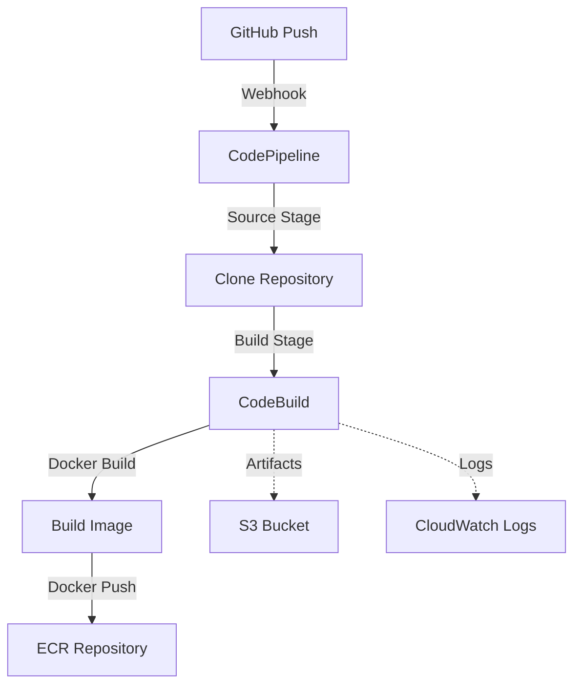
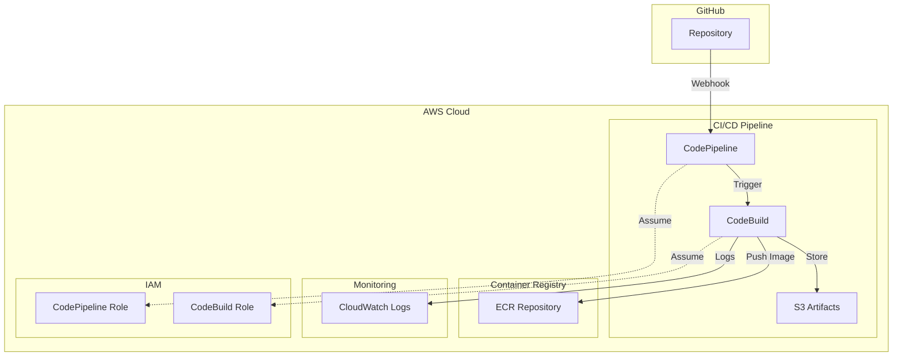

# CI/CD Pipeline - Visão Geral

## Templates CloudFormation

Disponibilizamos dois templates para integração com GitHub:

1. **[codepipeline.json](../../templates/cicd/codepipeline.json)** - Usando GitHub OAuth Token
2. **[codepipeline-codestar.json](../../templates/cicd/codepipeline-codestar.json)** - Usando CodeStar Connection (Recomendado)

## Descrição

Pipeline CI/CD automatizada que realiza build de imagens Docker e push para Amazon ECR utilizando CodePipeline e CodeBuild, com trigger automático via webhook do GitHub.

### Qual Template Usar?

#### CodeStar Connection (Recomendado)
Use se você já tem uma CodeStar Connection configurada no AWS Developer Tools. Mais seguro e fácil de gerenciar.

Ver guia: [CodeStar Connection Setup](codestar-connection.md)

#### GitHub Token
Use se precisa de deploy totalmente automatizado sem pré-requisitos.

Ver guia: [Setup Guide](setup-guide.md)

## Componentes da Pipeline

### AWS CodePipeline
Orquestra o fluxo completo de CI/CD desde o código fonte até o deploy da imagem no ECR.

### AWS CodeBuild
Executa o build da imagem Docker e realiza o push para o ECR.

### Amazon S3
Armazena artefatos da pipeline (código fonte e outputs de build).

### GitHub Webhook
Trigger automático da pipeline a cada push no branch configurado.

## Fluxo da Pipeline



## Stages da Pipeline

### 1. Source Stage
- Provider: GitHub
- Ação: Clone do repositório quando há push no branch
- Output: Código fonte como artefato

### 2. Build Stage
- Provider: CodeBuild
- Ação: Build da imagem Docker e push para ECR
- Input: Código fonte do stage anterior
- Output: Artefatos de build

## Recursos Criados

### IAM Roles

#### CodeBuild Service Role
Permissões:
- CloudWatch Logs (criar logs)
- S3 (ler/escrever artefatos)
- ECR (autenticação e push de imagens)

#### CodePipeline Service Role
Permissões:
- S3 (gerenciar artefatos)
- CodeBuild (iniciar builds)

### S3 Bucket
- Nome: `{ProjectName}-pipeline-artifacts-{Environment}`
- Versionamento: Habilitado
- Lifecycle: Deletar artefatos após 30 dias
- Encryption: AES256

### CodeBuild Project
- Compute: BUILD_GENERAL1_SMALL
- Image: aws/codebuild/standard:7.0
- Privileged Mode: Habilitado (necessário para Docker)
- Timeout: 30 minutos

### CodePipeline
- Stages: Source + Build
- Trigger: Webhook do GitHub
- Artifact Store: S3

### Webhook
- Integração automática com GitHub
- Filtro por branch específico
- Autenticação: GITHUB_HMAC

## Variáveis de Ambiente

O CodeBuild recebe automaticamente:

| Variável | Descrição | Origem |
|----------|-----------|--------|
| AWS_ACCOUNT_ID | ID da conta AWS | CloudFormation |
| AWS_DEFAULT_REGION | Região AWS | CloudFormation |
| ECR_REPOSITORY_NAME | Nome do repositório ECR | Parâmetro |
| IMAGE_TAG | Tag da imagem Docker | Parâmetro (default: latest) |
| ENVIRONMENT | Ambiente (dev/staging/prod) | Parâmetro |

## Diagrama de Arquitetura



## Segurança

### Encryption
- S3 Bucket: AES256 encryption at rest
- ECR: Encryption at rest habilitada
- Logs: CloudWatch Logs encrypted

### IAM Least Privilege
- Roles com permissões mínimas necessárias
- Acesso ao ECR restrito ao repositório específico
- Acesso ao S3 restrito ao bucket de artefatos

### Secrets Management
- GitHub Token: Passado como parâmetro NoEcho
- Recomendação: Usar AWS Secrets Manager em produção

### Network Security
- CodeBuild executa em VPC gerenciada pela AWS
- Webhook usa autenticação HMAC
- ECR requer autenticação

## Custos Estimados

### Desenvolvimento (baixo volume)

| Serviço | Uso Estimado | Custo Mensal |
|---------|--------------|--------------|
| CodeBuild | 100 builds/mês | ~$1.00 |
| CodePipeline | 1 pipeline ativa | $1.00 |
| S3 | 1GB storage | ~$0.02 |
| ECR | 10GB storage | ~$1.00 |
| CloudWatch Logs | 1GB ingestão | ~$0.50 |
| Total | - | ~$3.52 |

### Produção (médio volume)

| Serviço | Uso Estimado | Custo Mensal |
|---------|--------------|--------------|
| CodeBuild | 500 builds/mês | ~$5.00 |
| CodePipeline | 1 pipeline ativa | $1.00 |
| S3 | 5GB storage | ~$0.12 |
| ECR | 50GB storage | ~$5.00 |
| CloudWatch Logs | 5GB ingestão | ~$2.50 |
| Total | - | ~$13.62 |

## Monitoramento

### Métricas CodePipeline

```bash
aws cloudwatch get-metric-statistics \
  --namespace AWS/CodePipeline \
  --metric-name PipelineExecutionSuccess \
  --dimensions Name=PipelineName,Value=oms-spider-pipeline-dev \
  --start-time 2025-11-14T00:00:00Z \
  --end-time 2025-11-14T23:59:59Z \
  --period 3600 \
  --statistics Sum
```

### Métricas CodeBuild

```bash
aws cloudwatch get-metric-statistics \
  --namespace AWS/CodeBuild \
  --metric-name Builds \
  --dimensions Name=ProjectName,Value=oms-spider-build-dev \
  --start-time 2025-11-14T00:00:00Z \
  --end-time 2025-11-14T23:59:59Z \
  --period 3600 \
  --statistics Sum
```

### Logs

```bash
# Ver logs do CodeBuild
aws logs tail /aws/codebuild/oms-spider-dev --follow

# Ver logs de um build específico
aws codebuild batch-get-builds \
  --ids <build-id> \
  --query 'builds[0].logs'
```

## Alarmes Recomendados

### Build Failures

```bash
aws cloudwatch put-metric-alarm \
  --alarm-name oms-codebuild-failures \
  --alarm-description "Alerta de falhas no CodeBuild" \
  --metric-name FailedBuilds \
  --namespace AWS/CodeBuild \
  --statistic Sum \
  --period 300 \
  --evaluation-periods 1 \
  --threshold 3 \
  --comparison-operator GreaterThanThreshold \
  --dimensions Name=ProjectName,Value=oms-spider-build-dev
```

### Pipeline Failures

```bash
aws cloudwatch put-metric-alarm \
  --alarm-name oms-pipeline-failures \
  --alarm-description "Alerta de falhas na Pipeline" \
  --metric-name PipelineExecutionFailure \
  --namespace AWS/CodePipeline \
  --statistic Sum \
  --period 300 \
  --evaluation-periods 1 \
  --threshold 1 \
  --comparison-operator GreaterThanThreshold \
  --dimensions Name=PipelineName,Value=oms-spider-pipeline-dev
```

## Outputs do Template

| Output | Descrição | Uso |
|--------|-----------|-----|
| PipelineName | Nome da pipeline | Referência para comandos CLI |
| PipelineUrl | URL do console | Acesso rápido ao console |
| CodeBuildProjectName | Nome do projeto CodeBuild | Debugging e logs |
| ArtifactBucketName | Nome do bucket S3 | Acesso aos artefatos |
| WebhookUrl | URL do webhook | Configuração manual se necessário |

## Troubleshooting

### Pipeline não dispara automaticamente

Verificar:
1. Webhook está registrado no GitHub
2. Branch configurado está correto
3. Token do GitHub tem permissões necessárias

```bash
# Verificar webhook
aws codepipeline list-webhooks \
  --endpoint-url https://codepipeline.us-east-1.amazonaws.com
```

### Build falha na autenticação ECR

Verificar:
1. IAM Role do CodeBuild tem permissões ECR
2. Nome do repositório ECR está correto
3. Região está correta

```bash
# Testar autenticação ECR
aws ecr get-login-password --region us-east-1 | \
  docker login --username AWS --password-stdin \
  <account-id>.dkr.ecr.us-east-1.amazonaws.com
```

### Build timeout

Causas comuns:
- Imagem Docker muito grande
- Build steps demorados
- Download de dependências lento

Soluções:
- Aumentar timeout no template
- Usar cache de Docker layers
- Otimizar Dockerfile

### Erro de permissões

Verificar IAM roles:
```bash
# CodeBuild role
aws iam get-role --role-name oms-spider-codebuild-role-dev

# CodePipeline role
aws iam get-role --role-name oms-spider-codepipeline-role-dev
```

## Boas Práticas

### Segurança
1. Usar AWS Secrets Manager para GitHub token
2. Habilitar S3 bucket encryption
3. Usar ECR scan on push
4. Implementar branch protection no GitHub

### Performance
1. Usar cache de Docker layers
2. Otimizar Dockerfile (multi-stage builds)
3. Paralelizar steps quando possível
4. Usar compute type adequado ao workload

### Custos
1. Configurar lifecycle policy no S3
2. Limpar imagens antigas no ECR
3. Usar compute type mínimo necessário
4. Implementar retry logic com backoff

### Manutenção
1. Versionar buildspec.yml no repositório
2. Documentar mudanças na pipeline
3. Monitorar métricas e logs
4. Testar mudanças em ambiente dev primeiro
