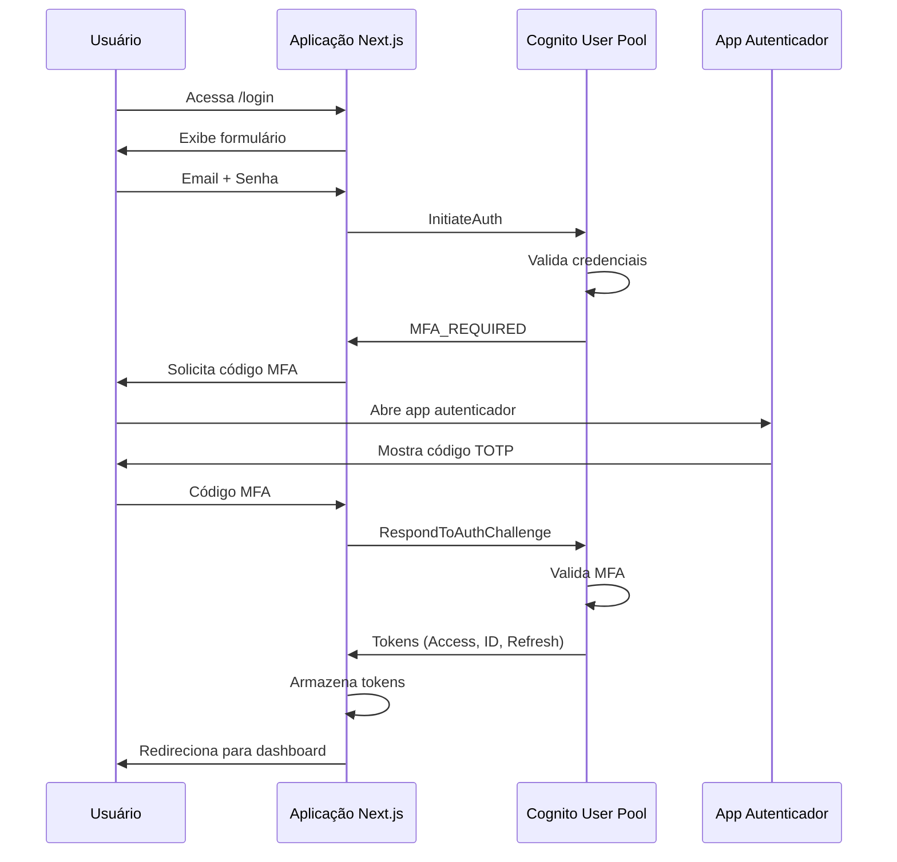

# AWS Cognito - Visão Geral

## Template CloudFormation

[cognito-user-pool.json](../../templates/cognito/cognito-user-pool.json)

## Descrição

O AWS Cognito User Pool é utilizado para autenticação e autorização de usuários administrativos do OMS. Fornece um sistema completo de gerenciamento de identidade com MFA obrigatório.

## Características Principais

### Autenticação
- Login via email
- MFA obrigatório (Software Token)
- Política de senha robusta
- Tokens JWT com validade configurável

### Grupos de Acesso

#### oms-admin (Precedência 1)
Administradores com acesso completo ao sistema.

Permissões:
- CRUD de clientes
- CRUD de produtos
- CRUD de usuários
- Gestão de configurações
- Visualização de todas as ordens e posições

#### oms-operator (Precedência 2)
Operadores com permissões de leitura e escrita limitadas.

Permissões:
- Visualização de clientes e produtos
- Leitura/escrita de ordens
- Visualização de posições
- Sem acesso a configurações críticas

#### oms-viewer (Precedência 3)
Visualizadores com acesso somente leitura.

Permissões:
- Visualização de clientes
- Visualização de produtos
- Visualização de ordens
- Visualização de posições
- Sem permissões de escrita

## Política de Senha

```json
{
  "MinimumLength": 12,
  "RequireUppercase": true,
  "RequireLowercase": true,
  "RequireNumbers": true,
  "RequireSymbols": true,
  "TemporaryPasswordValidityDays": 7
}
```

## Configuração de Tokens

| Token | Validade |
|-------|----------|
| Access Token | 1 hora |
| ID Token | 1 hora |
| Refresh Token | 30 dias |

## Fluxo de Autenticação



## Atributos Customizados

### custom:role
Armazena a role do usuário no sistema.

Valores possíveis:
- `admin`
- `operator`
- `viewer`

Este atributo é configurável pelo administrador e deve ser sincronizado com o grupo do usuário.

## Email Templates

### Email de Convite

```
Assunto: Seu acesso ao OMS Admin - {environment}

Olá,

Você foi convidado para acessar o painel administrativo do OMS.

📧 Usuário: {username}
🔑 Senha temporária: {####}

⚠️ IMPORTANTE:
1. No primeiro acesso, você deverá criar uma nova senha
2. Será necessário configurar MFA usando Google Authenticator ou Authy
3. A senha temporária expira em 7 dias

Em caso de dúvidas, entre em contato com o administrador do sistema.
```

## Advanced Security Mode

O User Pool está configurado com Advanced Security Mode habilitado, que fornece:

- Detecção de comprometimento de credenciais
- Proteção contra bots
- Detecção de anomalias
- Bloqueio adaptativo
- Risk-based authentication

## Recovery

Recuperação de conta configurada via email verificado.

Fluxo:
1. Usuário clica em "Esqueci minha senha"
2. Cognito envia código para email verificado
3. Usuário insere código e define nova senha
4. Nova senha deve atender política de segurança

## Outputs do Template

| Output | Descrição | Uso |
|--------|-----------|-----|
| UserPoolId | ID do User Pool | Configuração da aplicação |
| UserPoolClientId | ID do App Client | Configuração da aplicação |
| CognitoRegion | Região AWS | Configuração da aplicação |
| UserPoolArn | ARN do User Pool | Políticas IAM |
| GroupAdmin | Nome do grupo Admin | Referência |
| GroupOperator | Nome do grupo Operator | Referência |
| GroupViewer | Nome do grupo Viewer | Referência |

## Configuração na Aplicação

```javascript
// next-auth cognito provider
import CognitoProvider from 'next-auth/providers/cognito';

export const authOptions = {
  providers: [
    CognitoProvider({
      clientId: process.env.NEXT_PUBLIC_COGNITO_CLIENT_ID,
      clientSecret: process.env.COGNITO_CLIENT_SECRET,
      issuer: `https://cognito-idp.${process.env.NEXT_PUBLIC_AWS_REGION}.amazonaws.com/${process.env.NEXT_PUBLIC_COGNITO_USER_POOL_ID}`,
    })
  ],
};
```

## Gerenciamento de Usuários

### Criar Usuário via CLI

```bash
aws cognito-idp admin-create-user \
  --user-pool-id us-east-1_XXXXXXXXX \
  --username user@example.com \
  --user-attributes \
    Name=email,Value=user@example.com \
    Name=email_verified,Value=true \
    Name=custom:role,Value=operator \
  --desired-delivery-mediums EMAIL
```

### Adicionar Usuário ao Grupo

```bash
aws cognito-idp admin-add-user-to-group \
  --user-pool-id us-east-1_XXXXXXXXX \
  --username user@example.com \
  --group-name oms-operator
```

### Habilitar MFA para Usuário

```bash
aws cognito-idp admin-set-user-mfa-preference \
  --user-pool-id us-east-1_XXXXXXXXX \
  --username user@example.com \
  --software-token-mfa-settings Enabled=true,PreferredMfa=true
```

### Listar Usuários

```bash
aws cognito-idp list-users \
  --user-pool-id us-east-1_XXXXXXXXX
```

### Desabilitar Usuário

```bash
aws cognito-idp admin-disable-user \
  --user-pool-id us-east-1_XXXXXXXXX \
  --username user@example.com
```

### Deletar Usuário

```bash
aws cognito-idp admin-delete-user \
  --user-pool-id us-east-1_XXXXXXXXX \
  --username user@example.com
```

## Monitoramento

### Métricas CloudWatch

Métricas disponíveis:
- `SignInSuccesses`: Login bem-sucedidos
- `SignInThrottles`: Tentativas de login bloqueadas
- `TokenRefreshSuccesses`: Refresh token bem-sucedidos
- `UserAuthentication`: Autenticações de usuário

### Criar Alarme

```bash
aws cloudwatch put-metric-alarm \
  --alarm-name cognito-signin-failures \
  --alarm-description "Alert on Cognito sign-in failures" \
  --metric-name SignInThrottles \
  --namespace AWS/Cognito \
  --statistic Sum \
  --period 300 \
  --evaluation-periods 1 \
  --threshold 10 \
  --comparison-operator GreaterThanThreshold
```

## Custos

Pricing do AWS Cognito (região us-east-1):

| Tier | MAU | Preço |
|------|-----|-------|
| Free Tier | 0-50.000 | $0 |
| Tier 1 | 50.001-100.000 | $0.0055 por MAU |
| Tier 2 | 100.001-1.000.000 | $0.0046 por MAU |

MAU = Monthly Active Users (usuários que fazem login no mês)

Advanced Security Mode:
- $0.05 por tentativa de login (primeiras 1M tentativas/mês)

## Troubleshooting

### Usuário não recebe email de convite

Verificar:
1. Email está correto e verificado
2. Email não está em spam
3. SES sandbox mode (para produção, sair do sandbox)

### MFA não funciona

Verificar:
1. App autenticador está sincronizado com hora correta
2. Código foi gerado recentemente (validade: 30 segundos)
3. MFA foi configurado corretamente no primeiro login

### Token expirado

Utilizar refresh token para obter novos access e ID tokens:

```javascript
const response = await fetch(tokenEndpoint, {
  method: 'POST',
  headers: { 'Content-Type': 'application/x-www-form-urlencoded' },
  body: new URLSearchParams({
    grant_type: 'refresh_token',
    client_id: clientId,
    refresh_token: refreshToken,
  }),
});
```

## Segurança

### Prevenção de User Enumeration

A configuração `PreventUserExistenceErrors: ENABLED` garante que não seja possível determinar se um usuário existe através de mensagens de erro diferentes.

### Proteção contra Brute Force

Advanced Security Mode detecta e bloqueia tentativas de força bruta automaticamente.

### Auditoria

Todos os eventos de autenticação são logados no CloudWatch Logs para auditoria.

## Backup e Disaster Recovery

User Pools não possuem backup automático. Para disaster recovery:

1. Exportar usuários periodicamente
2. Manter template CloudFormation versionado
3. Documentar configurações customizadas

### Exportar Usuários

```bash
aws cognito-idp list-users \
  --user-pool-id us-east-1_XXXXXXXXX \
  --output json > users-backup-DD-MM-YYYY.json
```
