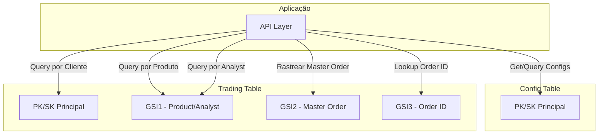
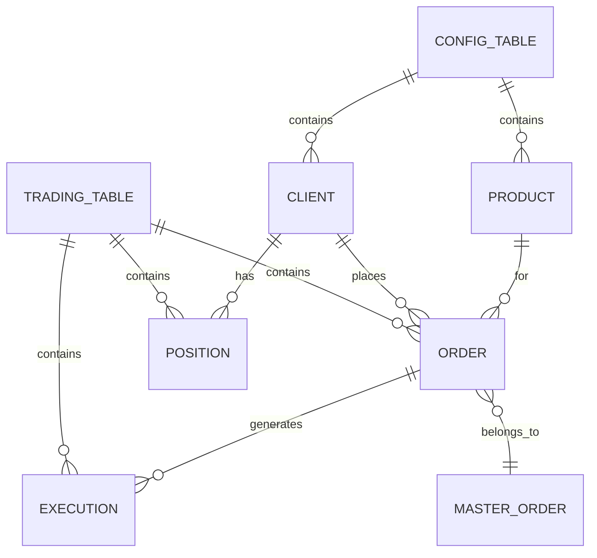

# DynamoDB - Visão Geral

## Templates CloudFormation

- [oms-config-table.json](../../templates/dynamodb/oms-config-table.json)
- [oms-trading-table.json](../../templates/dynamodb/oms-trading-table.json)

## Descrição

O OMS utiliza duas tabelas DynamoDB para armazenamento de dados:

1. **Config Table**: Configurações estáticas (produtos, clientes)
2. **Trading Table**: Dados transacionais (ordens, execuções, posições)

## Config Table

### Características

- **Billing Mode**: PAY_PER_REQUEST
- **Encryption**: KMS (Server-Side Encryption)
- **PITR**: Configurável por ambiente
- **Modelo**: Single-table design simples

### Estrutura de Chaves

```
PK: PRODUCT#{productId} | CLIENT#{clientId}
SK: CONFIG
```

### Entidades Armazenadas

- Produtos
- Clientes
- Configurações do sistema

### Padrões de Acesso

1. Buscar produto por ID
2. Listar todos os produtos
3. Buscar cliente por ID
4. Listar todos os clientes

## Trading Table

### Características

- **Billing Mode**: PAY_PER_REQUEST
- **Encryption**: KMS (Server-Side Encryption)
- **PITR**: Configurável por ambiente
- **TTL**: Habilitado (90 dias)
- **GSIs**: 3 índices secundários globais
- **Modelo**: Single-table design com múltiplas entidades

### Estrutura de Chaves

#### Índice Principal

```
PK: CLIENT#{clientId}
SK: ORDER#{timestamp}#{orderId} | EXECUTION#{timestamp}#{executionId} | POSITION#{symbol}#{side}
```

#### GSI1 - Queries por Produto/Analyst

```
GSI1_PK: PRODUCT#{productId} | ANALYST#{analystId}
GSI1_SK: {timestamp}
Projection: ALL
```

#### GSI2 - Rastreamento de Master Order

```
GSI2_PK: MASTER_ORDER#{masterOrderId}
GSI2_SK: {timestamp}
Projection: KEYS_ONLY
```

#### GSI3 - Lookup por Order ID

```
GSI3_PK: ORDER#{orderId}
GSI3_SK: {timestamp}
Projection: ALL
```

### Entidades Armazenadas

- Ordens (ORDER)
- Execuções (EXECUTION)
- Posições (POSITION)

### Padrões de Acesso

1. Buscar todas as ordens de um cliente
2. Buscar ordens por produto
3. Buscar ordens por analista
4. Rastrear child orders de uma master order
5. Buscar ordem por ID específico
6. Buscar posições de um cliente
7. Buscar execuções de uma ordem

## Diagrama de Acesso



## Padrões de Query

### Config Table

```bash
# Buscar produto
aws dynamodb get-item \
  --table-name oms_config_dev \
  --key '{"PK": {"S": "PRODUCT#1"}, "SK": {"S": "CONFIG"}}'

# Listar todos os produtos
aws dynamodb query \
  --table-name oms_config_dev \
  --key-condition-expression "begins_with(PK, :pk) AND SK = :sk" \
  --expression-attribute-values '{":pk": {"S": "PRODUCT#"}, ":sk": {"S": "CONFIG"}}'
```

### Trading Table

```bash
# Buscar ordens de um cliente
aws dynamodb query \
  --table-name oms_trading_data_dev \
  --key-condition-expression "PK = :pk AND begins_with(SK, :sk)" \
  --expression-attribute-values '{":pk": {"S": "CLIENT#client_123"}, ":sk": {"S": "ORDER#"}}'

# Buscar ordens por produto (GSI1)
aws dynamodb query \
  --table-name oms_trading_data_dev \
  --index-name GSI1 \
  --key-condition-expression "GSI1_PK = :pk" \
  --expression-attribute-values '{":pk": {"S": "PRODUCT#prod_001"}}'

# Rastrear child orders (GSI2)
aws dynamodb query \
  --table-name oms_trading_data_dev \
  --index-name GSI2 \
  --key-condition-expression "GSI2_PK = :pk" \
  --expression-attribute-values '{":pk": {"S": "MASTER_ORDER#master_789"}}'

# Buscar por order ID (GSI3)
aws dynamodb query \
  --table-name oms_trading_data_dev \
  --index-name GSI3 \
  --key-condition-expression "GSI3_PK = :pk" \
  --expression-attribute-values '{":pk": {"S": "ORDER#order_456"}}'
```

## Time-to-Live (TTL)

A Trading Table possui TTL configurado no atributo `ttl`:

```javascript
// Calcular TTL (90 dias a partir de agora)
const ttl = Math.floor(Date.now() / 1000) + (90 * 24 * 60 * 60);
```

Registros expirados são automaticamente deletados pelo DynamoDB sem custo adicional.

## Segurança

### Criptografia

Todas as tabelas utilizam criptografia KMS:

```json
{
  "SSESpecification": {
    "SSEEnabled": true,
    "SSEType": "KMS"
  }
}
```

### Point-in-Time Recovery

Habilitado em produção para recuperação de dados:

```json
{
  "PointInTimeRecoverySpecification": {
    "PointInTimeRecoveryEnabled": true
  }
}
```

Permite restaurar tabela para qualquer ponto nos últimos 35 dias.

## Outputs dos Templates

### Config Table

| Output | Descrição |
|--------|-----------|
| TableName | Nome da tabela |
| TableArn | ARN da tabela |

### Trading Table

| Output | Descrição |
|--------|-----------|
| TableName | Nome da tabela |
| TableArn | ARN da tabela |
| GSI1Name | Nome do GSI1 |
| GSI2Name | Nome do GSI2 |
| GSI3Name | Nome do GSI3 |

## Monitoramento

### Métricas CloudWatch

Métricas importantes:
- `ConsumedReadCapacityUnits`: Capacidade de leitura consumida
- `ConsumedWriteCapacityUnits`: Capacidade de escrita consumida
- `UserErrors`: Erros do usuário (ex: throttling)
- `SystemErrors`: Erros do sistema
- `ThrottledRequests`: Requisições throttled

### Criar Alarme de Throttling

```bash
aws cloudwatch put-metric-alarm \
  --alarm-name oms-trading-throttled-requests \
  --alarm-description "Alerta de throttling na tabela trading" \
  --metric-name ThrottledRequests \
  --namespace AWS/DynamoDB \
  --statistic Sum \
  --period 300 \
  --evaluation-periods 1 \
  --threshold 10 \
  --comparison-operator GreaterThanThreshold \
  --dimensions Name=TableName,Value=oms_trading_data_prod
```

## Custos

### Modelo PAY_PER_REQUEST

Pricing (região us-east-1):

| Operação | Custo |
|----------|-------|
| Write Request Unit | $1.25 por milhão |
| Read Request Unit | $0.25 por milhão |
| Storage | $0.25 por GB/mês |
| PITR | $0.20 por GB/mês |
| Backup On-Demand | $0.10 por GB/mês |

### Otimização de Custos

1. Usar BatchGetItem/BatchWriteItem quando possível
2. Implementar caching no client
3. Arquivar dados antigos em S3 via TTL
4. Avaliar uso de provisioned capacity para workloads previsíveis

## Backup e Recovery

### Backup Automático (PITR)

Habilitado em produção:

```bash
# Habilitar PITR
aws dynamodb update-continuous-backups \
  --table-name oms_trading_data_prod \
  --point-in-time-recovery-specification PointInTimeRecoveryEnabled=true

# Restaurar para um ponto no tempo
aws dynamodb restore-table-to-point-in-time \
  --source-table-name oms_trading_data_prod \
  --target-table-name oms_trading_data_restored \
  --restore-date-time 2025-11-14T10:00:00Z
```

### Backup Manual

```bash
# Criar backup on-demand
aws dynamodb create-backup \
  --table-name oms_trading_data_prod \
  --backup-name oms-trading-manual-backup-14-11-2025

# Listar backups
aws dynamodb list-backups \
  --table-name oms_trading_data_prod

# Restaurar de backup
aws dynamodb restore-table-from-backup \
  --target-table-name oms_trading_data_restored \
  --backup-arn arn:aws:dynamodb:us-east-1:123456789:table/oms_trading_data_prod/backup/xxx
```

## Export/Import

### Export para S3

```bash
aws dynamodb export-table-to-point-in-time \
  --table-arn arn:aws:dynamodb:us-east-1:123456789:table/oms_trading_data_prod \
  --s3-bucket my-backup-bucket \
  --s3-prefix oms-export/ \
  --export-format DYNAMODB_JSON
```

### Import de S3

```bash
aws dynamodb import-table \
  --s3-bucket-source my-backup-bucket \
  --input-format DYNAMODB_JSON \
  --table-creation-parameters file://table-config.json
```

## Diagrama de Relacionamento



## Performance

### Single-Table Design

Vantagens:
- Menos round-trips ao banco
- Melhor performance para queries relacionadas
- Menor custo (menos tabelas)
- Transações ACID dentro da mesma tabela

### GSI Strategy

- **GSI1 (ALL)**: Queries frequentes que precisam de todos os atributos
- **GSI2 (KEYS_ONLY)**: Apenas para rastreamento e contagem
- **GSI3 (ALL)**: Lookup completo por order ID

## Troubleshooting

### Throttling

Se estiver ocorrendo throttling:
1. Verificar se há hot partitions
2. Considerar batch operations
3. Implementar exponential backoff
4. Avaliar uso de provisioned capacity

### Queries Lentas

1. Verificar se está usando scan ao invés de query
2. Otimizar projeções dos GSIs
3. Adicionar filtros no client-side quando apropriado
4. Considerar criar GSI adicional para o padrão de acesso

### Custos Elevados

1. Analisar CloudWatch Metrics
2. Identificar queries desnecessárias
3. Implementar caching
4. Revisar estratégia de TTL
