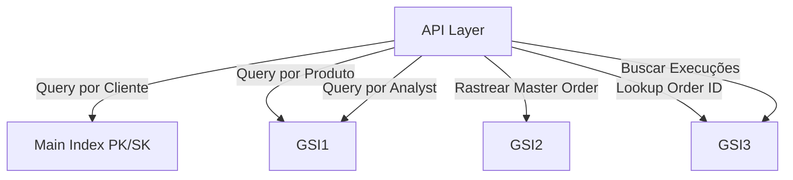

# Trading Table - Documentação

## Template CloudFormation

[oms-trading-table.json](../../templates/dynamodb/oms-trading-table.json)

## Descrição

Tabela DynamoDB para armazenamento de dados transacionais do OMS, incluindo ordens, execuções e posições.

## Características

- **Table Name**: `oms_trading_data_{environment}`
- **Billing Mode**: PAY_PER_REQUEST
- **Encryption**: KMS (Server-Side Encryption)
- **PITR**: Configurável por parâmetro
- **TTL**: Habilitado (atributo `ttl`, expiração em 90 dias)
- **GSIs**: 3 índices secundários globais

## Estrutura de Chaves

### Primary Key (Main Index)

```
PK (HASH): CLIENT#{clientId}
SK (RANGE): ORDER#{timestamp}#{orderId} | EXECUTION#{timestamp}#{executionId} | POSITION#{symbol}#{side}
```

### GSI1 - Queries por Produto/Analyst

```
GSI1_PK (HASH): PRODUCT#{productId} | ANALYST#{analystId}
GSI1_SK (RANGE): {timestamp}
Projection: ALL
```

Casos de uso:
- Listar todas as ordens de um produto
- Buscar ordens por analista
- Queries temporais por produto

### GSI2 - Rastreamento de Master Order

```
GSI2_PK (HASH): MASTER_ORDER#{masterOrderId}
GSI2_SK (RANGE): {timestamp}
Projection: KEYS_ONLY
```

Casos de uso:
- Rastrear todas as child orders de uma master order
- Agregação de execuções

### GSI3 - Lookup por Order ID

```
GSI3_PK (HASH): ORDER#{orderId}
GSI3_SK (RANGE): {timestamp}
Projection: ALL
```

Casos de uso:
- Busca rápida por ID de ordem
- Validação de existência de ordem

## Modelo de Dados

### Entidade: ORDER

```json
{
  "PK": "CLIENT#client_123",
  "SK": "ORDER#2025-11-14T10:30:00Z#order_456",
  "GSI1_PK": "PRODUCT#prod_001",
  "GSI1_SK": "2025-11-14T10:30:00Z",
  "GSI2_PK": "MASTER_ORDER#master_789",
  "GSI2_SK": "2025-11-14T10:30:00Z",
  "GSI3_PK": "ORDER#order_456",
  "GSI3_SK": "2025-11-14T10:30:00Z",
  "entity_type": "ORDER",
  "order_id": "order_456",
  "client_id": "client_123",
  "product_id": "prod_001",
  "symbol": "BTCUSDT",
  "side": "BUY",
  "quantity": 1.5,
  "price": 45000.00,
  "status": "FILLED",
  "order_type": "LIMIT",
  "master_order_id": "master_789",
  "created_at": "14/11/2025 10:30:00",
  "updated_at": "14/11/2025 10:31:15",
  "ttl": 1736856000
}
```

#### Atributos

| Atributo | Tipo | Descrição |
|----------|------|-----------|
| PK | String | Partition Key: CLIENT#{clientId} |
| SK | String | Sort Key: ORDER#{timestamp}#{orderId} |
| GSI1_PK | String | GSI1 Partition Key |
| GSI1_SK | String | GSI1 Sort Key |
| GSI2_PK | String | GSI2 Partition Key |
| GSI2_SK | String | GSI2 Sort Key |
| GSI3_PK | String | GSI3 Partition Key |
| GSI3_SK | String | GSI3 Sort Key |
| entity_type | String | Tipo da entidade: ORDER |
| order_id | String | ID único da ordem |
| client_id | String | ID do cliente |
| product_id | String | ID do produto |
| symbol | String | Símbolo negociado (ex: BTCUSDT) |
| side | String | Lado da ordem (BUY, SELL) |
| quantity | Number | Quantidade da ordem |
| price | Number | Preço da ordem |
| status | String | Status (NEW, FILLED, CANCELLED, etc) |
| order_type | String | Tipo (MARKET, LIMIT, STOP, etc) |
| master_order_id | String | ID da ordem master |
| created_at | String | Data de criação (DD/MM/YYYY HH:mm:ss) |
| updated_at | String | Data de atualização (DD/MM/YYYY HH:mm:ss) |
| ttl | Number | Unix timestamp para expiração (90 dias) |

### Entidade: EXECUTION

```json
{
  "PK": "CLIENT#client_123",
  "SK": "EXECUTION#2025-11-14T10:31:00Z#exec_111",
  "GSI1_PK": "PRODUCT#prod_001",
  "GSI1_SK": "2025-11-14T10:31:00Z",
  "GSI2_PK": "MASTER_ORDER#master_789",
  "GSI2_SK": "2025-11-14T10:31:00Z",
  "GSI3_PK": "ORDER#order_456",
  "GSI3_SK": "2025-11-14T10:31:00Z",
  "entity_type": "EXECUTION",
  "execution_id": "exec_111",
  "order_id": "order_456",
  "client_id": "client_123",
  "product_id": "prod_001",
  "symbol": "BTCUSDT",
  "side": "BUY",
  "quantity": 1.5,
  "price": 45000.00,
  "commission": 2.25,
  "executed_at": "14/11/2025 10:31:00",
  "ttl": 1736856000
}
```

#### Atributos

| Atributo | Tipo | Descrição |
|----------|------|-----------|
| execution_id | String | ID único da execução |
| order_id | String | ID da ordem relacionada |
| client_id | String | ID do cliente |
| product_id | String | ID do produto |
| symbol | String | Símbolo negociado |
| side | String | Lado (BUY, SELL) |
| quantity | Number | Quantidade executada |
| price | Number | Preço de execução |
| commission | Number | Comissão cobrada |
| executed_at | String | Data de execução (DD/MM/YYYY HH:mm:ss) |

### Entidade: POSITION

```json
{
  "PK": "CLIENT#client_123",
  "SK": "POSITION#BTCUSDT#LONG",
  "GSI1_PK": "PRODUCT#prod_001",
  "GSI1_SK": "POSITION#BTCUSDT",
  "entity_type": "POSITION",
  "client_id": "client_123",
  "product_id": "prod_001",
  "symbol": "BTCUSDT",
  "side": "LONG",
  "quantity": 3.5,
  "avg_entry_price": 44500.00,
  "unrealized_pnl": 1750.00,
  "realized_pnl": 500.00,
  "last_updated": "14/11/2025 10:35:00"
}
```

#### Atributos

| Atributo | Tipo | Descrição |
|----------|------|-----------|
| client_id | String | ID do cliente |
| product_id | String | ID do produto |
| symbol | String | Símbolo da posição |
| side | String | Lado da posição (LONG, SHORT) |
| quantity | Number | Quantidade da posição |
| avg_entry_price | Number | Preço médio de entrada |
| unrealized_pnl | Number | PnL não realizado |
| realized_pnl | Number | PnL realizado |
| last_updated | String | Última atualização (DD/MM/YYYY HH:mm:ss) |

## Padrões de Acesso

### 1. Buscar Ordens de um Cliente

```bash
aws dynamodb query \
  --table-name oms_trading_data_dev \
  --key-condition-expression "PK = :pk AND begins_with(SK, :sk)" \
  --expression-attribute-values '{
    ":pk": {"S": "CLIENT#client_123"},
    ":sk": {"S": "ORDER#"}
  }'
```

```javascript
// SDK JavaScript v3
import { DynamoDBClient, QueryCommand } from '@aws-sdk/client-dynamodb';

const client = new DynamoDBClient({ region: 'us-east-1' });

const command = new QueryCommand({
  TableName: 'oms_trading_data_dev',
  KeyConditionExpression: 'PK = :pk AND begins_with(SK, :sk)',
  ExpressionAttributeValues: {
    ':pk': { S: 'CLIENT#client_123' },
    ':sk': { S: 'ORDER#' },
  },
});

const response = await client.send(command);
```

### 2. Buscar Ordens por Produto (GSI1)

```bash
aws dynamodb query \
  --table-name oms_trading_data_dev \
  --index-name GSI1 \
  --key-condition-expression "GSI1_PK = :pk" \
  --expression-attribute-values '{
    ":pk": {"S": "PRODUCT#prod_001"}
  }'
```

### 3. Buscar Ordens por Analista (GSI1)

```bash
aws dynamodb query \
  --table-name oms_trading_data_dev \
  --index-name GSI1 \
  --key-condition-expression "GSI1_PK = :pk" \
  --expression-attribute-values '{
    ":pk": {"S": "ANALYST#analyst_001"}
  }'
```

### 4. Rastrear Child Orders de Master Order (GSI2)

```bash
aws dynamodb query \
  --table-name oms_trading_data_dev \
  --index-name GSI2 \
  --key-condition-expression "GSI2_PK = :pk" \
  --expression-attribute-values '{
    ":pk": {"S": "MASTER_ORDER#master_789"}
  }'
```

### 5. Buscar Ordem por ID (GSI3)

```bash
aws dynamodb query \
  --table-name oms_trading_data_dev \
  --index-name GSI3 \
  --key-condition-expression "GSI3_PK = :pk" \
  --expression-attribute-values '{
    ":pk": {"S": "ORDER#order_456"}
  }'
```

### 6. Buscar Posições de um Cliente

```bash
aws dynamodb query \
  --table-name oms_trading_data_dev \
  --key-condition-expression "PK = :pk AND begins_with(SK, :sk)" \
  --expression-attribute-values '{
    ":pk": {"S": "CLIENT#client_123"},
    ":sk": {"S": "POSITION#"}
  }'
```

### 7. Buscar Execuções de uma Ordem (GSI3)

```bash
aws dynamodb query \
  --table-name oms_trading_data_dev \
  --index-name GSI3 \
  --key-condition-expression "GSI3_PK = :pk AND begins_with(GSI3_SK, :sk)" \
  --expression-attribute-values '{
    ":pk": {"S": "ORDER#order_456"},
    ":sk": {"S": ""}
  }'
```

### 8. Criar Nova Ordem

```javascript
import { DynamoDBClient, PutItemCommand } from '@aws-sdk/client-dynamodb';

const ttl = Math.floor(Date.now() / 1000) + (90 * 24 * 60 * 60); // 90 dias

const command = new PutItemCommand({
  TableName: 'oms_trading_data_dev',
  Item: {
    PK: { S: 'CLIENT#client_123' },
    SK: { S: 'ORDER#2025-11-14T12:00:00Z#order_789' },
    GSI1_PK: { S: 'PRODUCT#prod_001' },
    GSI1_SK: { S: '2025-11-14T12:00:00Z' },
    GSI2_PK: { S: 'MASTER_ORDER#master_456' },
    GSI2_SK: { S: '2025-11-14T12:00:00Z' },
    GSI3_PK: { S: 'ORDER#order_789' },
    GSI3_SK: { S: '2025-11-14T12:00:00Z' },
    entity_type: { S: 'ORDER' },
    order_id: { S: 'order_789' },
    client_id: { S: 'client_123' },
    product_id: { S: 'prod_001' },
    symbol: { S: 'BTCUSDT' },
    side: { S: 'BUY' },
    quantity: { N: '2.5' },
    price: { N: '46000' },
    status: { S: 'NEW' },
    order_type: { S: 'LIMIT' },
    master_order_id: { S: 'master_456' },
    created_at: { S: '14/11/2025 12:00:00' },
    updated_at: { S: '14/11/2025 12:00:00' },
    ttl: { N: ttl.toString() },
  },
});

await client.send(command);
```

### 9. Atualizar Status de Ordem

```bash
aws dynamodb update-item \
  --table-name oms_trading_data_dev \
  --key '{
    "PK": {"S": "CLIENT#client_123"},
    "SK": {"S": "ORDER#2025-11-14T10:30:00Z#order_456"}
  }' \
  --update-expression "SET #status = :status, updated_at = :updated" \
  --expression-attribute-names '{"#status": "status"}' \
  --expression-attribute-values '{
    ":status": {"S": "FILLED"},
    ":updated": {"S": "14/11/2025 10:31:00"}
  }'
```

## Time-to-Live (TTL)

A tabela possui TTL configurado para expirar registros após 90 dias automaticamente.

### Calcular TTL

```javascript
// JavaScript
const ttl = Math.floor(Date.now() / 1000) + (90 * 24 * 60 * 60);
```

```python
# Python
import time
ttl = int(time.time()) + (90 * 24 * 60 * 60)
```

### Verificar TTL

```bash
aws dynamodb describe-time-to-live \
  --table-name oms_trading_data_dev
```

## Deploy

### Parâmetros

| Parâmetro | Tipo | Default | Descrição |
|-----------|------|---------|-----------|
| Environment | String | dev | Ambiente (dev/staging/prod) |
| TableName | String | oms_trading_data | Nome base da tabela |
| EnablePITR | String | false | Habilitar Point-in-Time Recovery |

### Deploy via CLI

```bash
aws cloudformation create-stack \
  --stack-name oms-trading-dev \
  --template-body file://templates/dynamodb/oms-trading-table.json \
  --parameters \
    ParameterKey=Environment,ParameterValue=dev \
    ParameterKey=TableName,ParameterValue=oms_trading_data \
    ParameterKey=EnablePITR,ParameterValue=false \
  --region us-east-1
```

### Deploy em Produção

```bash
aws cloudformation create-stack \
  --stack-name oms-trading-prod \
  --template-body file://templates/dynamodb/oms-trading-table.json \
  --parameters \
    ParameterKey=Environment,ParameterValue=prod \
    ParameterKey=TableName,ParameterValue=oms_trading_data \
    ParameterKey=EnablePITR,ParameterValue=true \
  --region us-east-1
```

## Diagrama de Acesso



## Boas Práticas

### Modelagem de Dados

1. Sempre incluir timestamp no SK para ordenação temporal
2. Manter GSIs atualizados em todas as operações
3. Calcular TTL corretamente (Unix timestamp)
4. Usar entity_type para facilitar queries

### Performance

1. Usar Query ao invés de Scan
2. Implementar paginação para grandes resultados
3. Usar BatchGetItem para múltiplos itens
4. Considerar cache para queries frequentes

### Segurança

1. Validar dados antes de inserir
2. Usar IAM roles para controle de acesso
3. Habilitar PITR em produção
4. Monitorar acessos via CloudTrail

## Monitoramento

### Métricas Importantes

```bash
# Read Capacity
aws cloudwatch get-metric-statistics \
  --namespace AWS/DynamoDB \
  --metric-name ConsumedReadCapacityUnits \
  --dimensions Name=TableName,Value=oms_trading_data_prod \
  --start-time 2025-11-14T00:00:00Z \
  --end-time 2025-11-14T23:59:59Z \
  --period 3600 \
  --statistics Sum

# Write Capacity
aws cloudwatch get-metric-statistics \
  --namespace AWS/DynamoDB \
  --metric-name ConsumedWriteCapacityUnits \
  --dimensions Name=TableName,Value=oms_trading_data_prod \
  --start-time 2025-11-14T00:00:00Z \
  --end-time 2025-11-14T23:59:59Z \
  --period 3600 \
  --statistics Sum
```

### Alarmes

```bash
# Throttling Alarm
aws cloudwatch put-metric-alarm \
  --alarm-name oms-trading-throttled \
  --metric-name ThrottledRequests \
  --namespace AWS/DynamoDB \
  --statistic Sum \
  --period 300 \
  --evaluation-periods 2 \
  --threshold 10 \
  --comparison-operator GreaterThanThreshold \
  --dimensions Name=TableName,Value=oms_trading_data_prod

# System Errors Alarm
aws cloudwatch put-metric-alarm \
  --alarm-name oms-trading-system-errors \
  --metric-name SystemErrors \
  --namespace AWS/DynamoDB \
  --statistic Sum \
  --period 300 \
  --evaluation-periods 1 \
  --threshold 5 \
  --comparison-operator GreaterThanThreshold \
  --dimensions Name=TableName,Value=oms_trading_data_prod
```

## Troubleshooting

### Throttling

Sintomas:
- Erros `ProvisionedThroughputExceededException`
- Latência alta

Soluções:
1. Implementar exponential backoff
2. Usar batch operations
3. Verificar hot partitions
4. Considerar provisioned capacity

### Queries Lentas

Causas comuns:
- Usando Scan ao invés de Query
- GSI não otimizado
- Falta de cache

Soluções:
1. Usar índices apropriados
2. Implementar cache (Redis)
3. Otimizar projeções de GSI
4. Paginar resultados grandes

### TTL Não Expirando

Causas:
- TTL não habilitado
- Valor TTL inválido
- Atributo TTL incorreto

Verificar:
```bash
aws dynamodb describe-time-to-live \
  --table-name oms_trading_data_dev
```

Habilitar:
```bash
aws dynamodb update-time-to-live \
  --table-name oms_trading_data_dev \
  --time-to-live-specification "Enabled=true, AttributeName=ttl"
```
