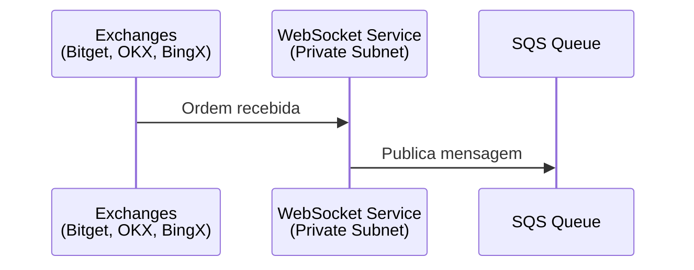
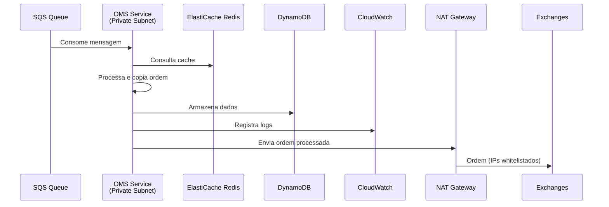
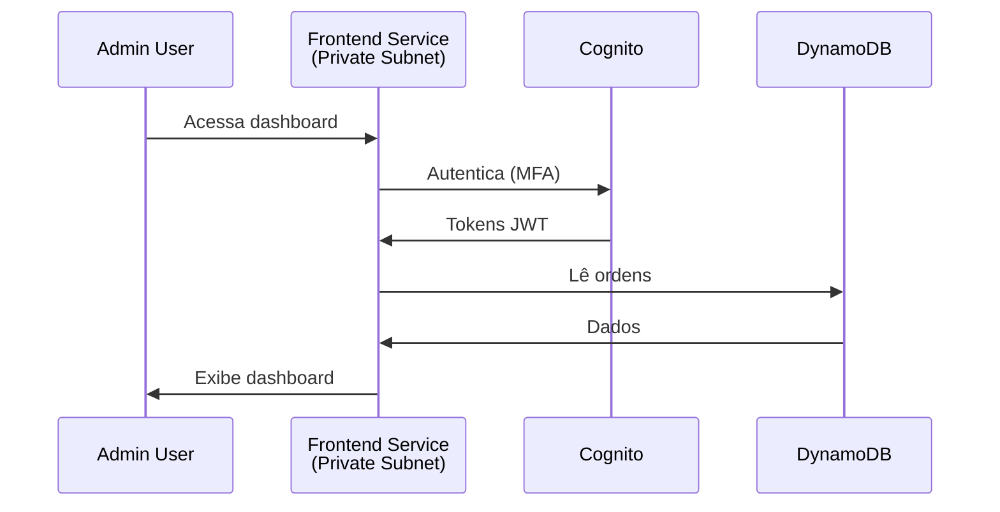
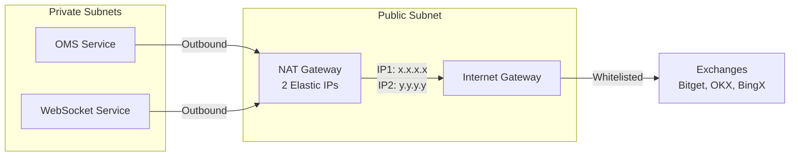
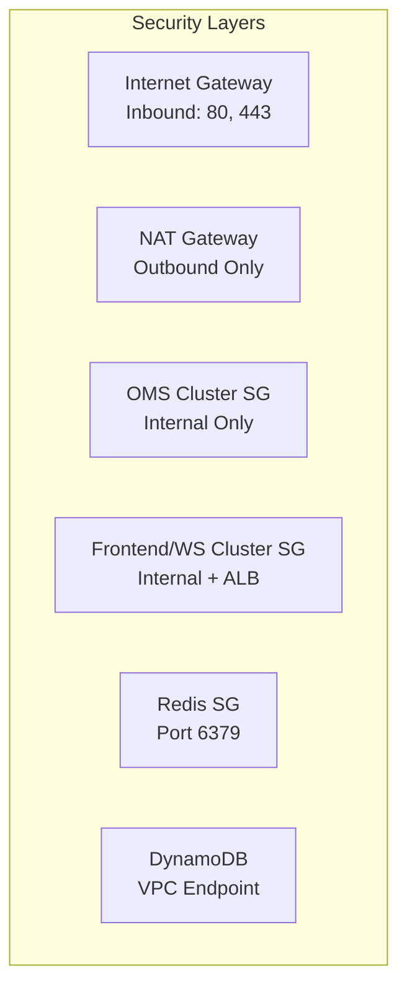
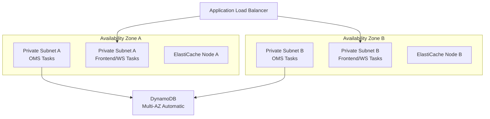

# Arquitetura OMS Spider - AWS

## Visão Geral

A arquitetura do OMS Spider é construída na AWS utilizando uma abordagem de microserviços containerizados com ECS EC2, garantindo alta disponibilidade, segurança e escalabilidade. A infraestrutura é projetada para atender requisitos específicos de exchanges que exigem whitelist de IPs estáticos.

## Diagrama de Arquitetura

Você pode visualizar e editar o diagrama usando [draw.io](https://app.diagrams.net/) ou a extensão Draw.io do VSCode.

## Componentes Principais

### 1. Networking - VPC

**VPC (Virtual Private Cloud)**
- Rede isolada na AWS que contém todos os recursos
- Subnets públicas e privadas para segregação de tráfego
- NAT Gateway com pool de 2 Elastic IPs para whitelist nas exchanges

**Public Subnet**
- Internet Gateway: Acesso à internet
- NAT Gateway: Tradução de endereços para subnets privadas
- Pool de 2 Elastic IPs estáticos (whitelistados nas exchanges)

**Private Subnets**
- Subnet OMS Cluster: Contém os containers do OMS
- Subnet Frontend/WebSocket Cluster: Contém frontend e websocket
- Sem acesso direto à internet (saída via NAT Gateway)

### 2. Compute - ECS EC2 Clusters

**Cluster OMS (Private Subnet)**
- **Responsabilidade**: Processar e copiar ordens
- **Função**:
  - Consome mensagens da fila SQS
  - Processa lógica de cópia de ordens
  - Envia ordens para exchanges (Bitget, OKX, BingX)
  - Armazena dados no DynamoDB
  - Registra logs no CloudWatch
  - Utiliza Redis para cache
- **Saída**: Via NAT Gateway (IPs whitelistados)

**Cluster Frontend/WebSocket (Private Subnet)**
- **WebSocket Service**:
  - Recebe ordens das exchanges
  - Publica mensagens na fila SQS
- **Frontend Service**:
  - Dashboard administrativo Next.js
  - Autenticação via Cognito
  - Leitura de ordens do DynamoDB
- **Saída**: Via NAT Gateway

### 3. Message Queue - SQS

**SQS Queue (Orders)**
- Fila de mensagens para desacoplar WebSocket e OMS
- Garante entrega confiável de ordens
- Permite processamento assíncrono

### 4. Cache - ElastiCache Redis

**Redis Cluster**
- Cache em memória para o OMS
- Armazena dados temporários e sessões
- Melhora performance de operações frequentes

### 5. Database - DynamoDB

**Trading Table**
- Armazena ordens, execuções e posições
- 3 GSIs para diferentes padrões de acesso
- Criptografia KMS
- Point-in-Time Recovery (produção)

**Config Table**
- Armazena produtos e clientes
- Configurações do sistema

### 6. Authentication - Cognito

**User Pool**
- Autenticação de usuários administrativos
- MFA obrigatório
- Grupos de acesso:
  - **Admin**: Acesso completo
  - **Operator**: Leitura/escrita de ordens
  - **Viewer**: Somente leitura

### 7. Monitoring - CloudWatch

**Logs**
- Logs do OMS Service
- Logs do WebSocket/Frontend
- Monitoramento e debugging

## Fluxo de Dados

### 1. Recebimento de Ordens

### 2. Processamento de Ordens

### 3. Acesso Administrativo

## Fluxo de Rede e Segurança

### Whitelist de IPs nas Exchanges

**Requisito Crítico**: As exchanges exigem whitelist de IPs estáticos. A arquitetura garante que:
- Todo tráfego de saída das Private Subnets passa pelo NAT Gateway
- NAT Gateway possui pool de 2 Elastic IPs fixos
- Esses 2 IPs são whitelistados nas exchanges

### Security Groups e NACLs

## Escalabilidade

### Auto Scaling

**ECS Services**
- Target Tracking Scaling baseado em CPU/Memory
- Scale out/in automático baseado em carga
- Min/Max instances configuráveis por ambiente

**DynamoDB**
- Modo PAY_PER_REQUEST (On-Demand)
- Escalabilidade automática
- Sem provisionamento manual de capacidade

**ElastiCache Redis**
- Configurável por ambiente (dev: t3.micro, prod: r6g.large)
- Opção de cluster mode para maior throughput

## Alta Disponibilidade

### Multi-AZ Deployment

## Ambientes

### Desenvolvimento (dev)
- 1 NAT Gateway
- ECS: t3.small instances
- Redis: t3.micro
- DynamoDB: PAY_PER_REQUEST
- CloudWatch: Retenção 7 dias

### Staging (staging)
- 2 NAT Gateways (Multi-AZ)
- ECS: t3.medium instances
- Redis: t3.small
- DynamoDB: PAY_PER_REQUEST
- CloudWatch: Retenção 14 dias

### Produção (prod)
- 2 NAT Gateways (Multi-AZ)
- ECS: t3.large+ instances
- Redis: r6g.large (cluster mode)
- DynamoDB: PAY_PER_REQUEST + PITR
- CloudWatch: Retenção 30 dias
- Backups automáticos

## Segurança

### Camadas de Segurança

1. **Network Layer**
   - VPC isolada com CIDR dedicado
   - Security Groups restritivos
   - NACLs para controle adicional
   - Private Subnets sem acesso direto à internet

2. **Application Layer**
   - Cognito MFA obrigatório
   - JWT tokens com expiração
   - Grupos de acesso (Admin, Operator, Viewer)

3. **Data Layer**
   - DynamoDB com criptografia KMS
   - Encryption at rest e in transit
   - Point-in-Time Recovery (produção)

4. **Secrets Management**
   - AWS Secrets Manager para credenciais
   - Rotação automática de secrets
   - Acesso via IAM roles (sem hardcoded secrets)

### Compliance

- Logs centralizados no CloudWatch
- Auditoria via CloudTrail
- Encryption em todas as camadas
- MFA obrigatório para acesso administrativo

## Custos Estimados (Mensais)

### Desenvolvimento
- **ECS EC2**: ~$30-50 (t3.small instances)
- **NAT Gateway**: ~$35
- **ElastiCache**: ~$15 (t3.micro)
- **DynamoDB**: ~$10-30 (baixo volume)
- **SQS**: ~$1
- **Cognito**: Grátis (< 50k MAU)
- **CloudWatch**: ~$5
- **Total**: ~$100-150/mês

### Produção
- **ECS EC2**: ~$150-300 (t3.large+ instances, multi-AZ)
- **NAT Gateway**: ~$70 (2 NAT Gateways multi-AZ)
- **ElastiCache**: ~$100-200 (r6g.large cluster)
- **DynamoDB**: ~$50-200 (baseado em volume)
- **SQS**: ~$5-20
- **Cognito**: Baseado em MAU
- **CloudWatch**: ~$20-50
- **Backups**: ~$10-50
- **Total**: ~$450-900/mês

## Disaster Recovery

### Backup Strategy

**DynamoDB**
- Point-in-Time Recovery (PITR) habilitado em produção
- Restauração até 35 dias atrás
- On-demand backups para snapshots específicos

**ElastiCache Redis**
- Snapshots automáticos diários
- Retenção configurável (7-35 dias)
- Restauração para novo cluster

**Configurações**
- Versionamento de templates CloudFormation
- Infrastructure as Code no Git
- Secrets no Secrets Manager

### RTO/RPO Targets

| Ambiente | RTO | RPO |
|----------|-----|-----|
| dev | 4 horas | 24 horas |
| staging | 2 horas | 4 horas |
| prod | 1 hora | 15 minutos |

## Monitoramento e Alertas

### CloudWatch Metrics

**ECS Metrics**
- CPU Utilization
- Memory Utilization
- Task Count
- Network In/Out

**Application Metrics**
- Order Processing Rate
- Queue Depth (SQS)
- Error Rate
- Latency P50, P95, P99

**Infrastructure Metrics**
- NAT Gateway Bytes
- Redis Hit Rate
- DynamoDB Consumed Capacity

### Alertas Críticos

1. **High Error Rate**: > 5% em 5 minutos
2. **Queue Backup**: > 1000 mensagens em fila
3. **ECS Service Unhealthy**: < 50% tasks healthy
4. **Redis Memory**: > 80% utilização
5. **NAT Gateway Bytes**: Anomalia detectada

## Próximos Passos

1. **Implementação de Templates**
   - VPC e Networking (CloudFormation)
   - ECS Clusters e Services
   - SQS e ElastiCache
   - Application Load Balancer

2. **CI/CD Enhancement**
   - Pipeline de deploy automatizado
   - Blue/Green deployments
   - Rollback automático

3. **Observabilidade**
   - Distributed tracing (X-Ray)
   - Custom metrics e dashboards
   - Log aggregation e análise

4. **Performance Optimization**
   - Cache warming strategies
   - Connection pooling
   - Batch processing para DynamoDB
